# OverTheWire

## Bandit

### Level 0

### Goal
Log into the game using SSH.

### Connection
```bash
ssh bandit0@bandit.labs.overthewire.org -p 2220
```
Password: `bandit0`

### What does each part mean?

| Part | Meaning |
|---|---|
| `ssh` | protocol to connect remotely to another machine |
| `bandit0@` | the username you log in with |
| `bandit.labs.overthewire.org` | the server you are connecting to |
| `-p 2220` | the port (SSH uses 22 by default, here it is different) |

### Capure:
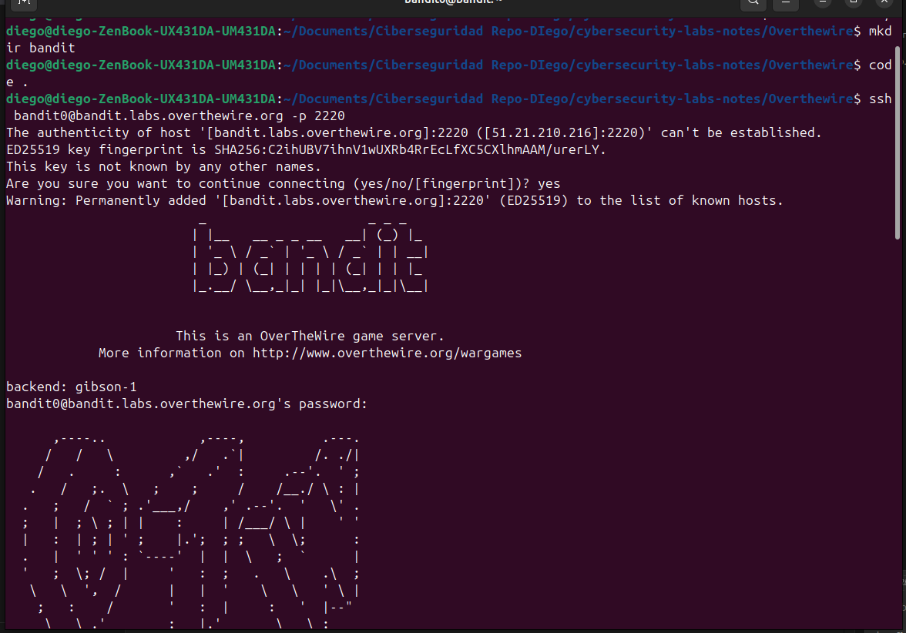

### Level 1
### Goal
Find the password for the next level.

### Steps
1. Run `ls` to list all files. There is only one file: `README`.
2. Run `cat README` to print the content in the console. The new password appears there.

### Capure:
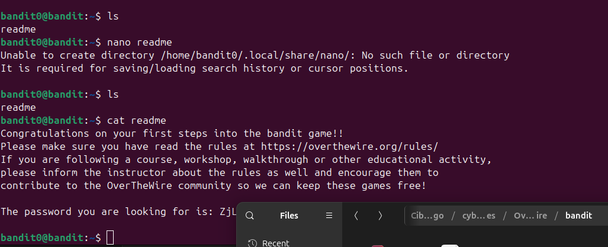

### Level 2
### Goal
Find the password for the next level.
### Steps
1. Run `ls` to list all files. There is only one file: `-`.
2. Run `cat ./-` to print the file content in the console and reveal the password.

Why `./-`?
Using only `-` can be interpreted as a special option by commands. Prefixing it with `./` tells the shell this is a file in the current directory, so `cat` reads the file correctly.

### Capure:
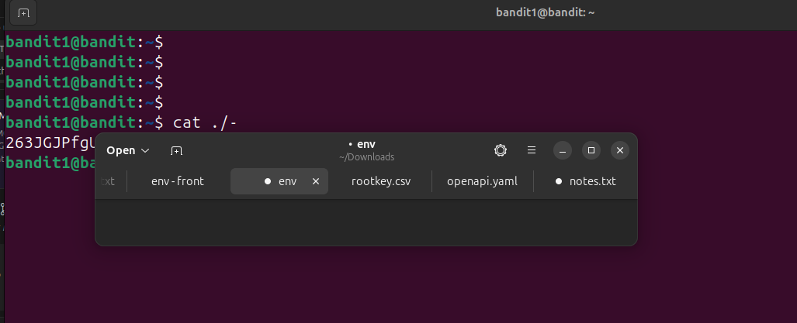

### Level 3
### Goal
Find the password stored in a file called `--spaces in this filename--`
located in the home directory.

### Steps
1. Run `ls -la` to list all files and see the exact filename.
2. Run `cat -- "--spaces in this filename--"` to print the file content
and reveal the password.

**Why quotes `" "`?**
The filename contains spaces. Without quotes, bash interprets each word
as a separate file. Wrapping the filename in quotes tells bash
this is ONE single filename.

**Why `--` before the filename?**
The filename starts with `-`, which bash normally interprets as a
command flag/option. The `--` tells bash:
"stop reading flags, everything after this is a filename."
Without it, bash gets confused and throws a "No such file" error.

### Capture
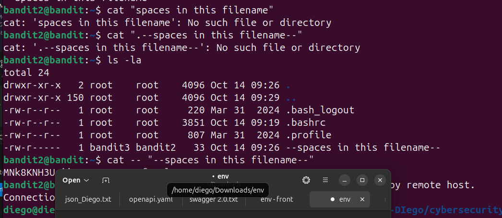

### What I learned
- How to handle filenames with spaces using quotes `" "`
- How to handle filenames starting with `-` using `--`
- How to use `ls -la` to inspect files in detail

### Level 4
### Goal
Find the password stored in a hidden file in the `~/inhere` directory.

### Steps
1. Run `ls -al` to list all files, including hidden ones. Look for files that start with `.`
   - The hidden file is: `...Hiding-From-You`
2. Run `cat "...Hiding-From-You"` to print the file content and reveal the password.

**Why `-a` flag?**
By default, `ls` hides files that begin with a dot (`.`). The `-a` flag shows ALL files, including hidden ones.

**Why quotes around the filename?**
The filename starts with `.` which is unusual. Using quotes ensures bash treats it as a single filename, even with the unusual name.

### Capture
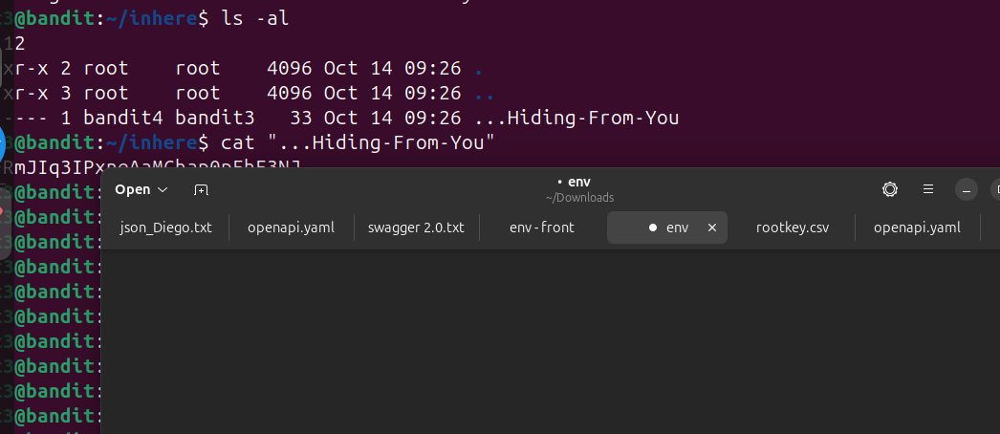

### What I learned
- Hidden files in Linux start with a `.` (dot)
- Use `ls -a` or `ls -al` to reveal hidden files
- Files are hidden by convention to keep directories clean, not for security


### Level 5
### Goal
Find the password among multiple files. Only one file contains human-readable text (ASCII); the rest are binary data.

### Steps
1. Run `ls -la` to list all files in the `~/inhere` directory.
   - There are 10 files: `-file00`, `-file01`, ... `-file09`
2. Use `cat -- -fileXX` to check each file and find the one with readable text.
   - Most files contain binary/garbled data.
   - `-file07` contains: `4oQYVPk......` (the password)

**Why `--` again?**
The filenames start with `-`, so bash would interpret them as flags. Using `--` tells bash "these are filenames, not flags."

**Why do we need to check each file?**
The challenge teaches us to:
- Read file content and recognize readable text vs. binary data
- Manually search through files when you don't know which one contains what
- Use `cat` to inspect file contents

**Alternative (faster method):**
You could use `file` command to identify file types:
```bash
file -- -file*
```
This shows which files are ASCII text vs. binary, so you find the password file instantly.

### Capture
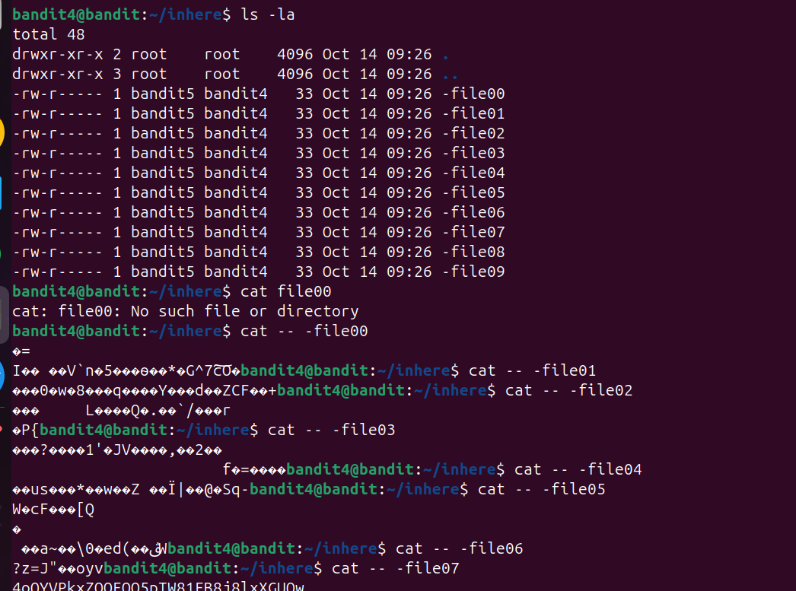

### What I learned
- How to identify readable text vs. binary data
- Using `--` to handle filenames starting with `-`
- The `file` command can quickly identify file types

### Level 6
### Goal
Find the password file inside `~/inhere` using specific file properties.

### Steps
1. Run this command:
```bash
find -type f -size 1033c ! -executable
```
2. The command returns one match:
```bash
./maybehere07/.file2
```
3. Read the file:
```bash
cat ./maybehere07/.file2
```
4. Output:
```text
HWasn..........
```

### Why this works
- `find`: searches recursively from the current directory.
- `-type f`: only regular files (not directories).
- `-size 1033c`: only files of exactly 1033 bytes (`c` = bytes).
- `! -executable`: excludes executable files.

This combination filters the directory until only the correct file remains.

### Capture
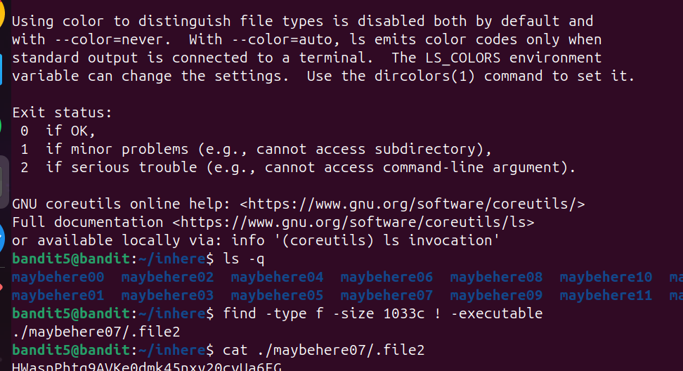

### What I learned
- How to use `find` with multiple conditions
- How to filter by exact file size in bytes
- How to negate conditions with `!` (not)

### Level 7
### Goal
Find the password file anywhere on the system with these properties:
- Owned by user `bandit7`
- Owned by group `bandit6`
- Size exactly `33` bytes

### Steps
1. Search from root with filters:
```bash
find / -type f -user bandit7 -group bandit6 -size 33c
```
2. You may see many `Permission denied` messages. This is normal when your user cannot read protected directories.
3. Hide those errors by redirecting stderr:
```bash
find / -type f -user bandit7 -group bandit6 -size 33c 2>/dev/null
```
4. Result:
```text
/var/lib/dpkg/info/bandit7.password
```
5. Read the password file:
```bash
cat /var/lib/dpkg/info/bandit7.password
```

### Why your first `cat` failed
You used:
```bash
cat ./var/lib/dpkg/info/bandit7.password
```
`./` means "from the current directory" (for example, `~/var/...`), and that path does not exist.

The correct file is at an absolute path:
```bash
cat /var/lib/dpkg/info/bandit7.password
```

### Why `2>/dev/null` works
- `2` is stderr (error output)
- `>` redirects output
- `/dev/null` discards it

So `2>/dev/null` hides error lines like `Permission denied` and keeps only useful results.

### Capture
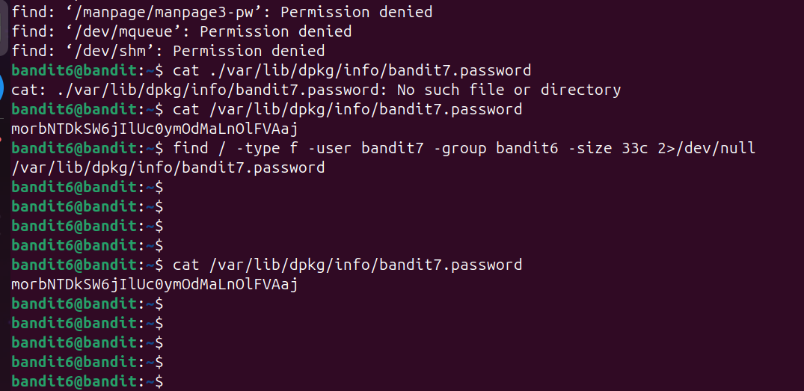

### What I learned
- Difference between relative paths (`./...`) and absolute paths (`/...`)
- How to combine multiple `find` filters
- How to hide noisy errors with `2>/dev/null`

### Level 8
### Goal
Find the password for the next level by searching for the word `millionth` inside a large text file.

### Steps
1. Search for the line containing `millionth`:
```bash
grep "millionth" data.txt
```
2. Output:
```text
millionth	dfwvzFQ...........
```
3. Optional: open the manual to learn more `grep` options:
```bash
man grep
```

### Why this works
- `grep` searches text line by line for a pattern.
- `millionth` is unique in the file, so `grep` returns exactly the line you need.
- The second field in that line is the password.

### Capture
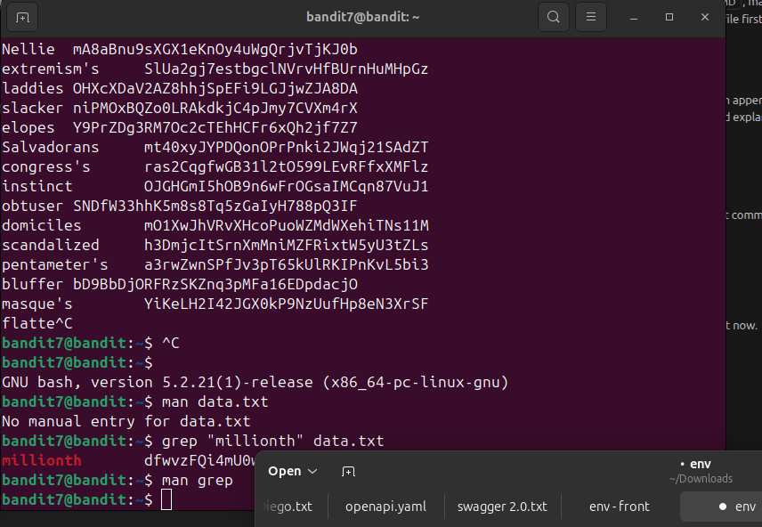

### What I learned
- How to use `grep` to find specific text quickly in large files
- How to extract useful data from command output
- How to use `man grep` to learn command options and flags

### Level 9
### Goal
Find the password for the next level in `data.txt`, where all lines are repeated except one unique line.

### Steps
1. Sort the file and show only lines that appear once:
```bash
sort data.txt | uniq -u
```
2. Output:
```text
4CKMh1JI91bUIZZ..........
```

### Why this works
- `sort` groups identical lines together.
- `uniq -u` prints only lines that are unique (appear exactly once).
- Since the password is the only non-repeated line, it is returned directly.

### Capture
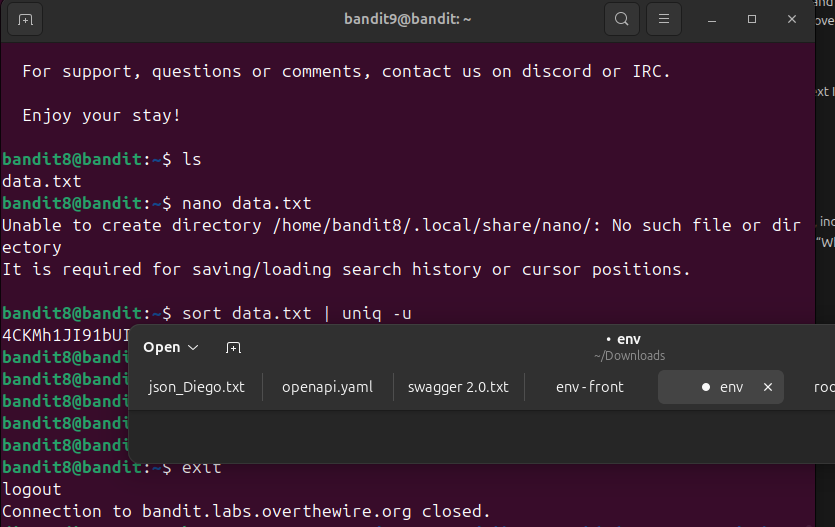

### What I learned
- How to combine commands with pipes (`|`)
- Why `uniq` usually needs sorted input
- How to find a unique value in a large repeated dataset

### Level 10
### Goal
Find the password for the next level in `data.txt`, which contains binary data mixed with human-readable text.

### Steps
1. Extract readable strings from binary data and filter for lines containing "=":
```bash
strings data.txt | grep "="
```
2. Output (partial):
```text
========== the
9=H`
[!#=Z
========== password
xWf=
f\Z'========== is
e=i{\#
/1=s
nS=F
M=Sl
+=LGT
y =1
========== FGUW5ilLVJrxX..........
'+Y=+
```

### Why this works
- `strings` extracts printable text sequences from binary files.
- `grep "="` filters only lines containing the equals sign.
- The password appears at the end with the `=` character separating it from the word "is".

### Capture
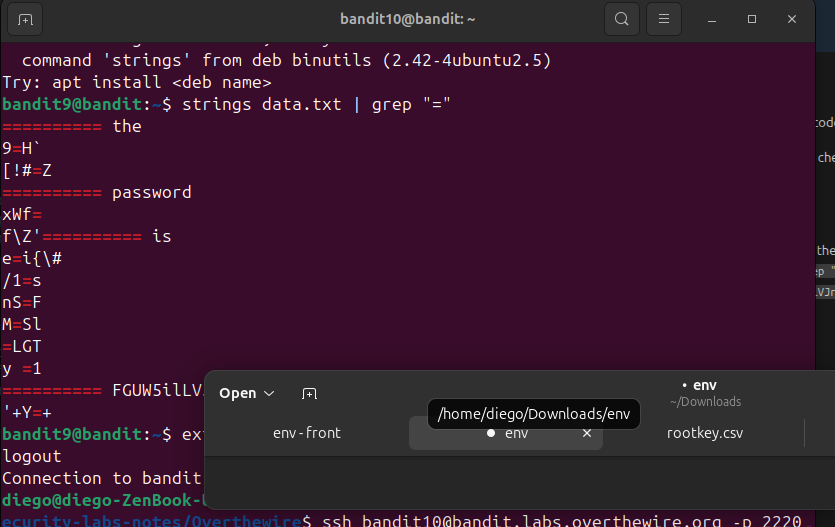

### What I learned
- How to extract readable strings from binary data using `strings`
- How to identify patterns in mixed binary/text files
- How `grep` can filter output for specific characters, even in binary data

### Level 11
### Goal
Find the password for the next level in `data.txt`, which contains base64-encoded data.

### Steps
1. List the files in the directory:
```bash
ls
```
2. Output:
```text
data.txt
```
3. Decode the base64-encoded data:
```bash
base64 -d data.txt
```
4. Output:
```text
The password is dtR17..............
```

### Why this works
- `base64 -d` decodes base64-encoded text back to its original form.
- The file contains only base64 data, so decoding reveals the password directly.
- Base64 is a common encoding method (not encryption) for transmitting binary data as text.

### Capture
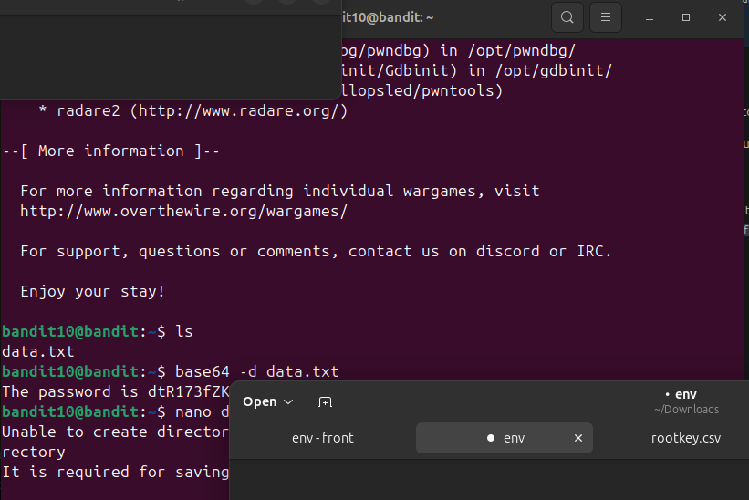

### What I learned
- How to identify base64-encoded data
- How to use `base64 -d` to decode files
- The difference between encoding (reversible) and encryption (requires a key)

### Level 12
### Goal
Find the password for the next level. The text in `data.txt` is encoded with ROT13.

### Steps
1. Read the file:
```bash
cat data.txt
```
2. Output:
```text
Gur cnffjbeq vf 7k16JArUVv5LxVuJfsSVdbbtaHGlw9D4
```
3. Decode ROT13 using `tr`:
```bash
cat data.txt | tr 'A-Za-z' 'N-ZA-Mn-za-m'
```
4. Output:
```text
The password is 7x16WNeH.............
```

### Why this works
- ROT13 shifts each letter by 13 positions.
- `tr` maps `A-Z` and `a-z` to their ROT13 equivalents.
- Decoding reveals the plain text sentence with the password.

### Capture
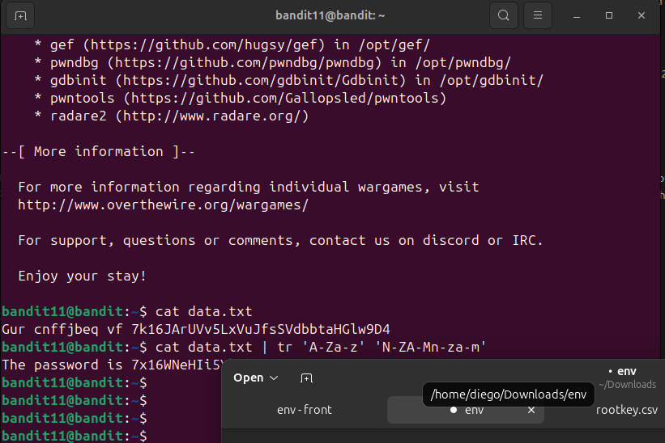

### What I learned
- How to detect and decode ROT13 text
- How to use `tr` for character substitution
- Why simple encodings can be reversed with basic shell tools


